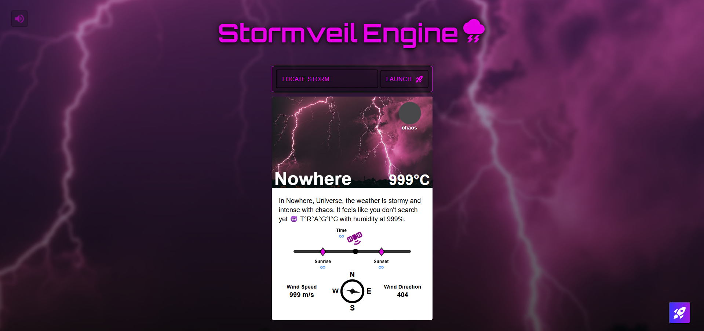
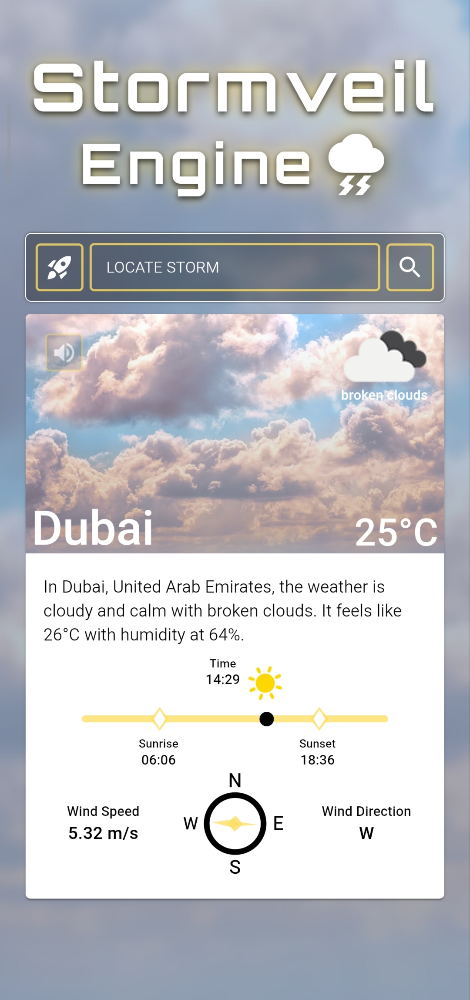
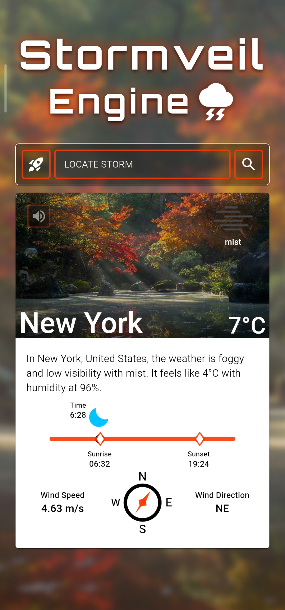
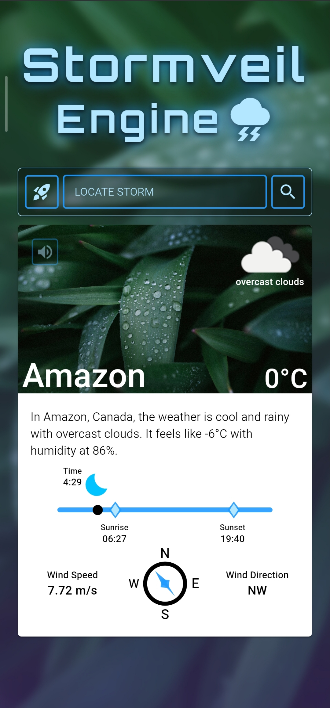
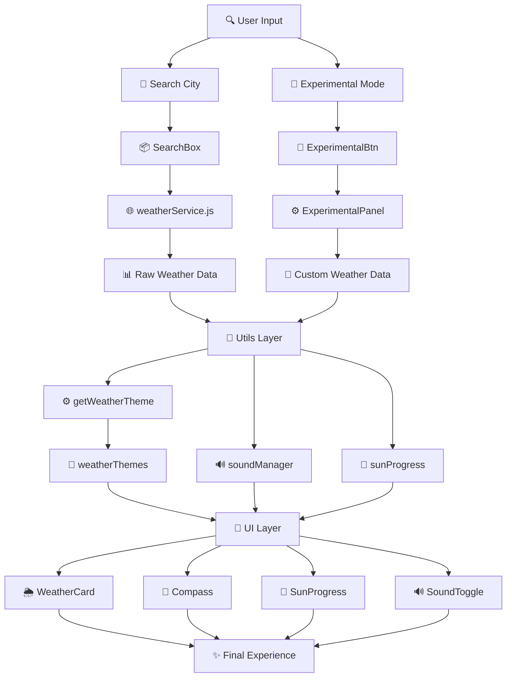

# 🌩️ Stormveil Engine

Stormveil Engine is a dynamic weather web application that transforms real-time weather data into immersive visual experiences.

Instead of just displaying weather information, it adapts the entire UI — including background, gradients, colors, and effects — based on live conditions, creating a unique atmosphere for every location.

This is my first React-based project — fully responsive across devices — and also my first time designing and integrating a dynamic ambient sound system from scratch, pushing both UI and experience beyond just visuals.

> *⭐ If this project helped or inspired you, consider giving it a star — it really motivates me to keep building!*

<br>

## 🚀 Live Demo

Click here to experience Stormveil Engine in action 👉 [⛈️ Stormveil Engine 🌩️]

> 💡 **Pro Tip:** Skip the search — trigger Experimental Mode and explore the full experience in one tap 🚀
> 
> 🎧 **Bonus:** Turn on sound and explore the atmosphere — each weather has its own vibe 😈

⚡ Not just weather… it’s an experience.

<br>

## 📸 Preview

| ⚡ First Impression |
|:--:|
|  |
| *Custom weather… full chaos mode activated 😈* |

| ☁️ Cloudy Mode | 🌫️ Mist Mode | 🌧️ Rain Mode |
|:--:|:--:|:--:|
|  |  |  |
| *Soft skies with calm golden tones* | *Foggy vibes with low visibility atmosphere* | *Deep green rain theme with immersive feel* |

<br>

## ⚡ Beyond the Tutorial

Started with a basic tutorial… ended up building a full engine 😈  
Not just upgrades — complete transformation.

| Feature | What I Built | Impact |
|:--|:--|:--|
| 🧭 **Wind System** | Custom compass with smooth JS rotation | Real-time visual wind direction 🧠 |
| 🌅 **Sun Progress** | Sunrise → current → sunset timeline | Makes time feel alive, not static ⏳ |
| 🔊 **Sound Engine** | Weather-based ambient system (FFmpeg processed) | Adds immersive atmosphere 🎧 |
| 🎨 **Theme Engine** | Dynamic UI based on weather conditions | Every city feels visually unique 🎨 |
| 🧪 **Experimental Mode** | One-tap multi-weather exploration | Skip searching → instant experience 🚀 |
| 🧱 **Architecture** | Structured React setup (hooks, utils, services) | Scalable & maintainable codebase ⚙️ |
| ✨ **UI/UX** | Smooth transitions + responsive layout | Clean feel + satisfying experience 😌 |

### 💬 Reality Check

⏱️ Tutorial → *~1 day, 2 components*  
🧠 Stormveil → *15+ days, multiple systems*

Not a straight path.<br>
Failed attempts. Broken logic. Rebuilds 🤕<br>
But every failure shaped the final result.

💀 It wasn’t clean. It wasn’t easy. But it was worth it.

<br>

## 🤖 AI-Powered Workflow

Built with the help of AI — but not by blindly accepting everything.

This project was shaped through continuous iteration:<br>
prompt → result → refine → reject → rebuild 💪🏻

| ⚙️ How I Used AI | 📌 Key Learnings |
|:--|:--|
| 🧠 Provided detailed context instead of vague prompts | AI is powerful — but **only as good as the input you give** |
| 🔁 Iterated multiple times to reach the right solution | First answer is rarely the best one |
| ❌ Rejected outputs that didn’t match the vision | Real value comes from **iteration, not generation** |
| 🛠️ Refined and customized instead of copy-pasting | You don’t follow AI… you **guide it** |

**Not just using AI… learning how to think with it**

<br>

## 🤝 Meet the Real MVPs

Behind Stormveil Engine is a powerful squad that made everything possible.  
Big respect to the legends who brought this experience to life 👇

### 🎵 Sound Department (a.k.a. Vibe Engineers)

| Name | Contribution | Link |
|:--|:--|:--|
| 🎧 **Junaid Music Artist** | Chief Noise Controller & Vibe Engineer 😎 | 🔗 [Junaid-Artist](https://www.linkedin.com/in/junaid-developer) |
| 🌐 **Pixabay** | Clean, copyright-free sound assets | 🔗 [Pixabay](https://pixabay.com) |
| 🔥 **Mixkit** | The real MVP… carried the vibe 💀 | 🔗 [Mixkit](https://mixkit.co) |
| ⚙️ **FFmpeg** | Audio processing & refinement tool | 🔗 [FFmpeg](https://www.ffmpeg.org/) |

### 🖼️ Visual Department (a.k.a. Atmosphere Designers)

| Name | Contribution | Link |
|:--|:--|:--|
| 📸 **Unsplash** | Cinematic images powering every theme ✨ | 🔗 [Unsplash](https://unsplash.com) |

### 💬 Special Note

All resources used are free and belong to their respective creators.  
I just combined them with a little bit of logic… and a lot of chaos 😈  

Huge thanks to these platforms for making creativity accessible 💙

<br>

## 🛠️ Tech Stack

| Layer | Powering It |
|:--|:--|
| ⚛️ Core |    |
| 🎨 UI Engine |   |
| 🌍 Data |  |
| 🔊 Sound System |   |
| 🧠 Brain |   |
| 🔧 Version Control |   |
| 🚀 Launchpad |  |

<br>

## ✨ Features

| Feature | Experience |
|:--|:--|
| 🌍 Real-time Data | Live weather powered by OpenWeather API |
| 🎨 Dynamic Themes | UI transforms based on weather conditions |
| ⚡ Smooth Transitions | Fluid animations across storm, snow, rain & more |
| 🔊 Sound System | Ambient weather audio for immersive feel 🎧 |
| 🧭 Weather Details | Wind, direction, sunrise & sunset visualization |
| 📱 Responsive Design | Built for desktop, refined for mobile 😈 |

<br>

## 📁 Project Structure

Stormveil Engine follows a modular and scalable React architecture  
focused on separation of concerns and clean logic flow 💪🏻

> Built with structure, not chaos… even if the UI says otherwise 😈

```bash
Stormveil-engine
│
├── 📂 public
│   └── 🖼️ react.svg
│
├── 📂 src
│   │
│   ├── 📂 assets                      🎨 Static resources
│   │   ├── 📂 images                  🖼️ Weather backgrounds
│   │   │   ├── 🖼️ cloudy.avif
│   │   │   ├── 🖼️ cold.jpg
│   │   │   ├── 🖼️ default.avif
│   │   │   ├── 🖼️ fog.jpg
│   │   │   ├── 🖼️ hot.jpg
│   │   │   ├── 🖼️ rain.jpg
│   │   │   ├── 🖼️ snow.jpg
│   │   │   └── 🖼️ storm.avif
│   │   │
│   │   ├── 📂 preview                 📸 README showcase
│   │   │   ├── 🖼️ cloudy.jpg
│   │   │   ├── 🖼️ fog.jpg
│   │   │   ├── 🖼️ rain.jpg
│   │   │   └── 🖼️ first-impression.png
│   │   │
│   │   └── 📂 sounds                  🔊 Ambient sound system
│   │       ├── 📂 storm               ⚡ Storm sound pack
│   │       │   ├── 🔊 lightning1_loud.mp3
│   │       │   ├── 🔊 lightning2_loud.mp3
│   │       │   ├── 🔊 lightning3_loud.mp3
│   │       │   └── 🔊 storm_base.mp3
│   │       │
│   │       ├── 🔊 cloudy.mp3
│   │       ├── 🔊 cold.mp3
│   │       ├── 🔊 default.mp3
│   │       ├── 🔊 fog.mp3
│   │       ├── 🔊 hot.mp3
│   │       ├── 🔊 rain.mp3
│   │       └── 🔊 snow.mp3
│   │
│   ├── 📂 components                 🧩 UI Components
│   │   ├── 📂 Compass
│   │   │   ├── 🎨 Compass.css
│   │   │   └── ⚛️ Compass.jsx
│   │   │
│   │   ├── 📂 ExperimentalBtn
│   │   │   ├── 🎨 ExperimentalBtn.css
│   │   │   └── ⚛️ ExperimentalBtn.jsx
│   │   │
│   │   ├── 📂 ExperimentalPanel
│   │   │   ├── 🎨 ExperimentalPanel.css
│   │   │   └── ⚛️ ExperimentalPanel.jsx
│   │   │
│   │   ├── 📂 SearchBox
│   │   │   ├── 🎨 SearchBox.css
│   │   │   └── ⚛️ SearchBox.jsx
│   │   │
│   │   ├── 📂 SoundToggle
│   │   │   ├── 🎨 SoundToggle.css
│   │   │   └── ⚛️ SoundToggle.jsx
│   │   │
│   │   ├── 📂 SunProgress
│   │   │   ├── 🎨 SunProgress.css
│   │   │   └── ⚛️ SunProgress.jsx
│   │   │
│   │   └── 📂 WeatherCard
│   │       ├── 🎨 WeatherCard.css
│   │       └── ⚛️ WeatherCard.jsx
│   │
│   ├── 📂 config                     ⚙️ Configuration
│   │   └── 📜 weatherThemes.js
│   │
│   ├── 📂 data                       🧪 Experimental data
│   │   └── 📜 experimentalWeather.js
│   │
│   ├── 📂 hooks                      🧠 Custom hooks
│   │   └── 📜 useCompassAnimation.js
│   │
│   ├── 📂 services                   🌐 API layer
│   │   └── 📜 weatherService.js
│   │
│   ├── 📂 utils                      🛠️ Utility functions
│   │   ├── 📜 getWeatherTheme.js
│   │   ├── 📜 soundManager.js
│   │   └── 📜 sunProgress.js
│   │
│   ├── 🎨 App.css
│   ├── ⚛️ App.jsx
│   └── ⚛️ main.jsx                  🚀 Entry point
│
├── 🔐 .env
├── 📜 .gitignore
├── ⚙️ eslint.config.js
├── 🌐 index.html
├── ⚖️ LICENSE
├── 📦 package.json
├── 📦 package-lock.json
├── ⚡ vite.config.js
└── 📘 README.md
```

<br>

## 🧠 Application Workflow

Not magic — just structured flow and controlled chaos 😎
> ⚡ Experimental mode bypasses API for instant rendering



<br>

## 🧩 Key Concept

Stormveil Engine is built on a simple but powerful concept:  
**don’t just display weather — translate it.**
> "Weather is not just data — it's an experience."

Instead of showing raw API data, the app transforms it into a dynamic environment using:

- 🎨 CSS variable–driven theming
- ⚡ State-based UI transformations
- 🔊 Context-aware sound design

Every weather condition becomes a **visual + interactive experience** —  
where colors, motion, and sound work together to reflect the atmosphere of a place.

💡 The goal isn’t accuracy alone… it’s **immersion**.<br>
💀 Because plain numbers don’t tell stories… experiences do.

<br>

## ⚔️ Challenges & Learnings

Building Stormveil Engine wasn’t just about writing code —  
it was about patience, failure, and persistence 💪🏻

### 🔥 Challenges Faced

| Challenge | Details |
|:--|:--|
| 🧠 **Designing Dynamic Theme Logic** | Mapping real-world weather into meaningful UI experiences wasn’t straightforward |
| 🔄 **State & UI Synchronization** | Keeping data, theme, sound, and UI perfectly aligned required multiple rebuilds |
| 🔊 **Sound System (The Toughest One 💀)** | Not just logic — finding the right copyright-free sounds was the real challenge. First attempts failed completely… almost felt impossible |
| 🌅 **Time-Based Calculations** | Converting raw timestamps into a smooth and accurate sun progress system |
| 🧪 **Experimental Mode Architecture** | Building a parallel flow (no API → instant UI) without breaking the main system |

### 📌 What I Learned

| Learning | Insight |
|:--|:--|
| ⏳ **Give time without guilt** | Good things take time. Rushing only breaks them |
| 💘 **Work on what truly matters** | If it’s important to you, it deserves your time and focus |
| 🔁 **Failure is part of the system** | Sometimes one more attempt turns multiple failures into something meaningful 🌩️ |
| 🧪 **Not every experiment needs to succeed 😂** | Some ideas are meant to stay in experimental branches… and that’s okay |
| 🌿 **Patience creates premium results** | The sound system proved it — first day nothing, second day everything 💪🏻 |

### 🧠 Developer Growth

| Growth Area | Transformation |
|:--|:--|
| 🔧 **Git & GitHub became real tools** | Not just deployment — but a safe space to experiment without fear |
| 🌱 **Confidence to break things** | Branches allowed trying new ideas freely, knowing nothing is permanently lost |
| ⚡ **Iteration mindset** | Build → break → fix → improve → repeat |

### 💬 Reality

There were failed attempts 🤕  
Experiments that didn’t work  
Ideas that had to be dropped  

But every step moved the project forward.

😈 Not built in one go… built through patience, failure, and persistence  
💀 Clean UI… messy journey behind it

<br>

## ⚙️ Setup & Installation

**Want to run this project locally? Follow these simple steps.**

**1. Clone the repository**
```bash
git clone https://github.com/YOUR_USERNAME/Stormveil-Engine.git
```

**2. Navigate to project**
```bash
cd Stormveil-Engine
```

**3. Install dependencies**
```bash
npm install
```

**4. Create a `.env` file in the root directory**
```bash
VITE_WEATHER_API_KEY=your_api_key_here
```

**5. Run development server**
```bash
npm run dev
```

<br>

## 🤝 Contributing

Contributions, ideas, and improvements are always welcome 💪🏻

If you’d like to contribute:

1. 🍴 Fork the repository  
2. 🌿 Create a new branch (`git checkout -b feature/your-feature-name`)
3. 🛠️ Make your changes
4. ✅ Commit your work (`git commit -m "feat: your message"`)
5. 🚀 Push to your branch (`git push origin feature/your-feature-name`)
6. 🔁 Open a Pull Request

<br>

## 🙏 Acknowledgements

A big thanks to **[Shradha Khapra](https://www.linkedin.com/in/shradha-khapra) ([Apna College](https://www.apnacollege.in/))** for providing the initial guidance and foundation through her tutorials.

This project began as a learning step — but quickly evolved into something much more through experimentation, iteration, and independent development 💪🏻

Tutorial gave the base… I built the engine

<br>

## ⚖️ License

MIT License © 2026 Junaid Usmani  

For more details, check the [`LICENSE`](./LICENSE) file.

<br>

## ✨ Final Note

Stormveil Engine is more than just a weather app.  
It’s a combination of logic, design, experimentation, and persistence.

Built with curiosity 💭  
Refined with patience ⏳  
Powered by chaos 😈  

<h3 align="center">
  Made with 💖 by <a href="https://www.linkedin.com/in/junaid-developer" target="_blank">Junaid</a>
</h3>
